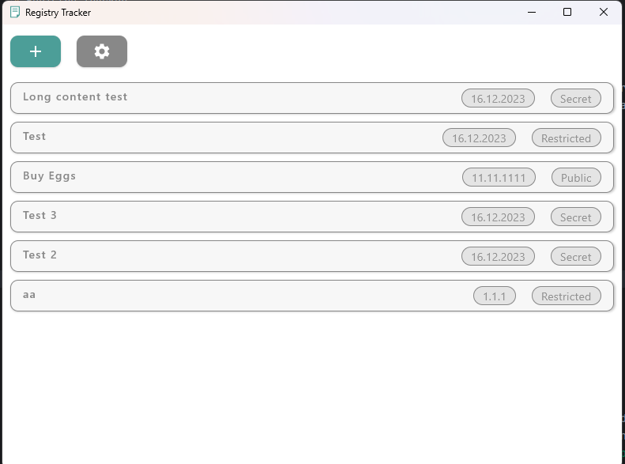
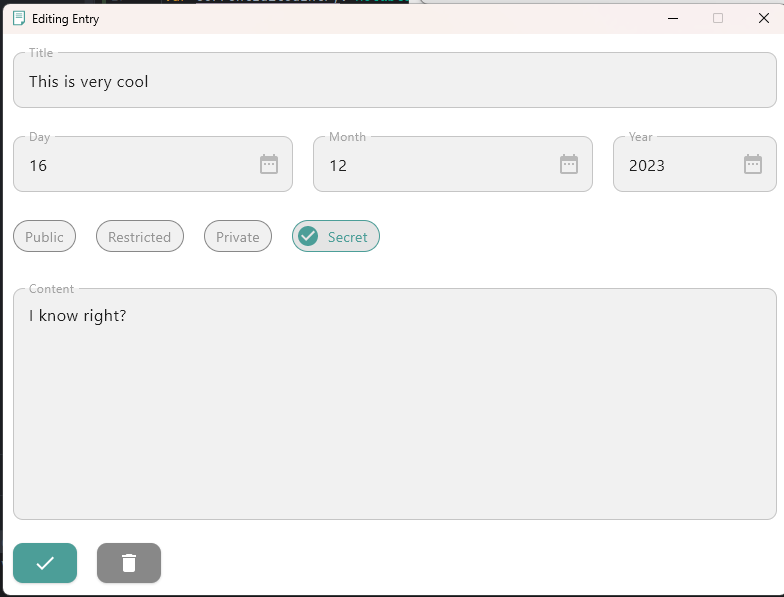
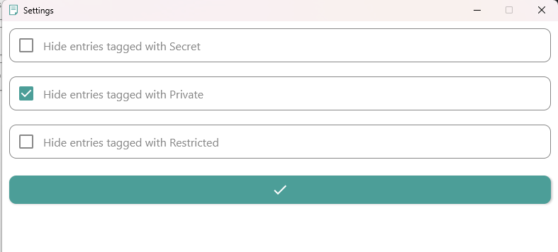

# Registry Tracker
by Integr aka. Erik

---
### Purpose
Track entries in the JSON file format. Just enter the values into the creation window, and the program will do the rest. 
Also, automatically loads all entries on boot, so you can easily see all your entries. You may call it an advanced note-taking app.

### Progress
 - [x] Implement JSON saving and reading
 - [x] Implement the creation Window
 - [x] Implement settings
 - [x] Implement entry list
 - [x] Implement editing
 - [x] Implement Installer

### Images

### Building yourself
> [!CAUTION]
> Only do this if you know what you are doing

Clone the repository and navigate to the folder you cloned it into.
Run the gradle script `packageDistributionForCurrentOS` by opening the terminal (If you haven't done so already) and
run `./gradlew packageDistributionForCurrentOS`. Gradle will now make an installer for the current operating system.
The created file can by default be found under `.\build\compose\binaries\main\<your_installer_type>`. 
(For example if you are on windows `msi`)

### Resources used
- Kotlin - Base language
- Compose for Desktop - UI framework
- Google GSON - Parsing JSON files
- Gradle - Build tool
- AppDirs by Harawata - Dynamic app directories

### Availability
- [x] Windows [Tested]
- [x] Linux [Not Tested]
- [ ] MacOS [Not Tested]